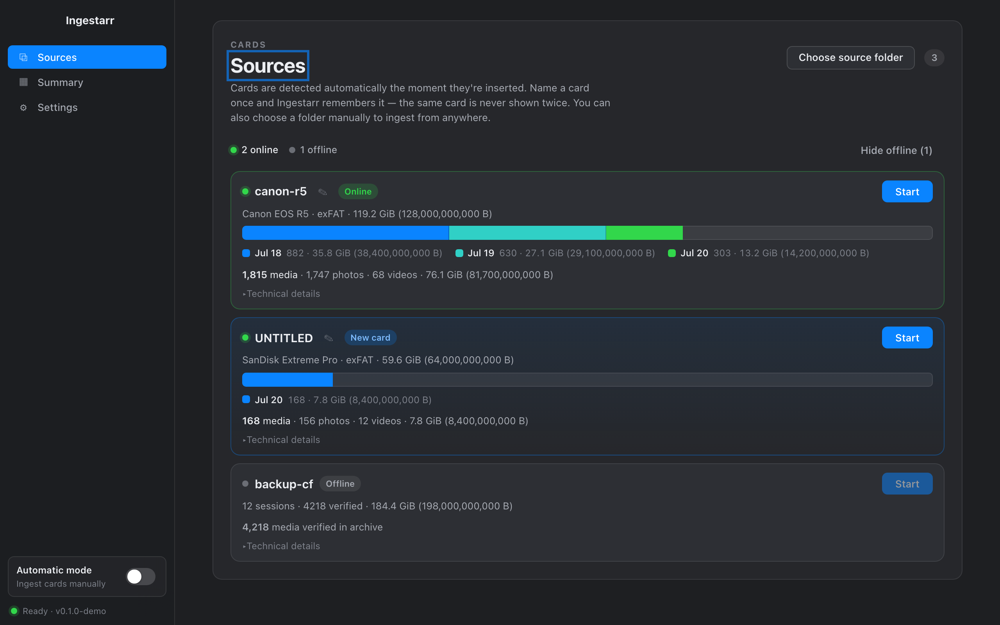
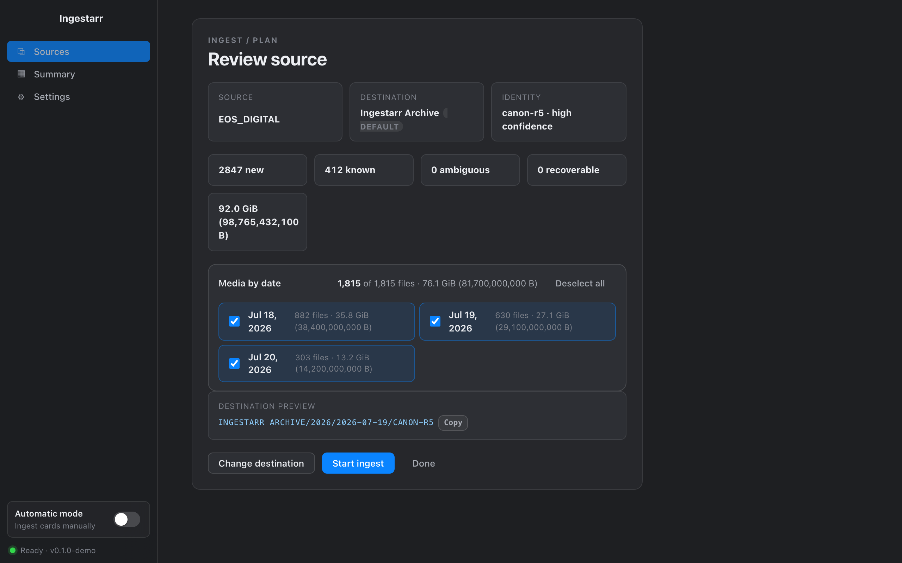
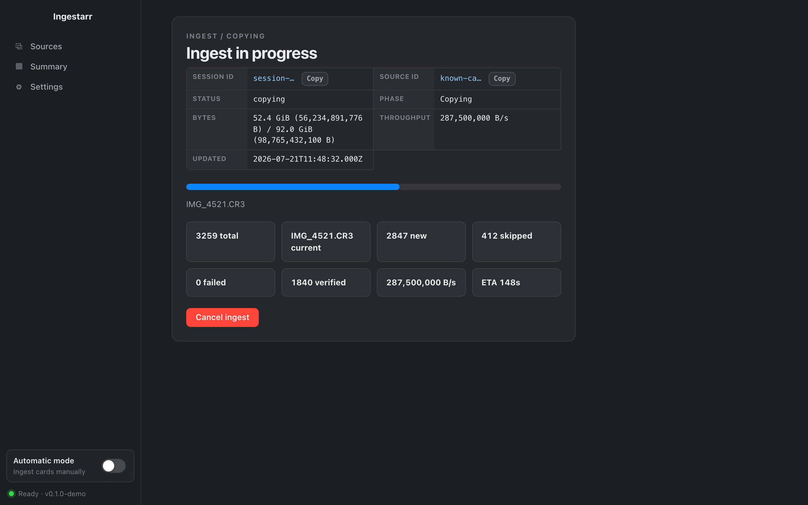
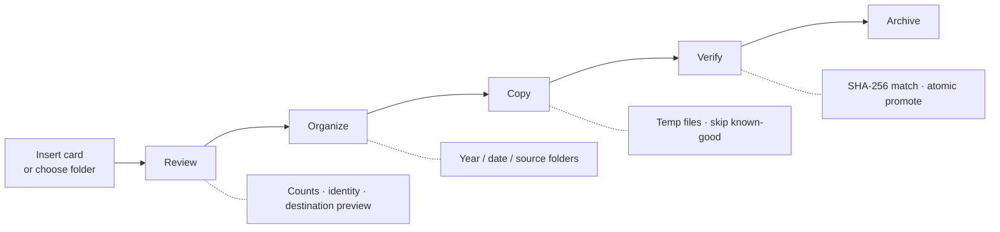

# Ingestarr

[](https://github.com/S33G/ingestarr/actions/workflows/ci.yml)
[](https://github.com/S33G/ingestarr/actions/workflows/build-desktop.yml)

**Bring your media home — safely.**

Ingestarr is a local-first desktop app for photographers, videographers, and anyone who moves
irreplaceable media from SD cards, cameras, and folders. It reviews what is on a card before
anything is copied, organizes files by capture date and source, skips media you have already
verified, and independently checksums every byte that lands on disk.

> **Early stage.** Ingestarr is under active development. There are no release downloads yet,
> interfaces may change, and builds are unsigned. See [Project status](#project-status).

## Screenshots

_Mock data — representative of the desktop UI._

| Sources | Review |
| --- | --- |
|  |  |



---

## Why Ingestarr?

| | |
| --- | --- |
| **Review before you copy** | See file counts, estimated size, source identity, and the destination layout before ingest starts. Select specific capture dates when you only want part of a card. |
| **Cards, recognized** | Insert an SD card and Ingestarr detects it. Nickname a card once — the same physical card is never shown twice. |
| **Verified, not guessed** | New files copy through a temporary path, get an independent SHA-256 hash, and are promoted only when source and destination match. Existing verified files are skipped. |
| **Stays on your machine** | Scanning, metadata extraction, copying, verification, and catalog data all run locally. No cloud upload step. |
| **Built to recover** | Sessions persist. Interrupted ingests can be resumed. Per-file errors are recorded instead of failing silently. |

---

## How it works



1. **Detect** — Removable volumes are discovered automatically. You can also pick any folder manually.
2. **Review** — Ingestarr scans the source, classifies files as new, known, ambiguous, or recoverable, and previews where media will land.
3. **Organize** — Destination paths follow capture metadata (`year/date/source/filename`) with safe fallbacks when EXIF is missing.
4. **Copy & verify** — Media streams into exclusive temporary files. Each copy is hashed and compared to the source before promotion. Verified duplicates are skipped.

Turn on **Automatic mode** in the sidebar to ingest inserted cards without clicking Start.

---

## Features

### Sources & ingest

- Automatic detection of removable volumes (macOS, Windows, Linux adapters)
- Sources tab with online/offline status, capacity-style media breakdown by capture date, and one-click Start
- Source nicknames and durable identity (fingerprint, platform volume ID, on-card markers)
- Manual folder ingest for any path on disk
- Pre-ingest review with destination preview and per-date file selection
- Configurable destination root, naming templates, extension allowlists, and path exclusions
- Optional grouping by source nickname in the destination tree
- Automatic ingest on card insert (when a destination is configured)
- Live byte and file progress, cancellation, and desktop notifications

### Safety & integrity

- Copy-through-temporary-file with no-replace promotion
- Independent SHA-256 verification of source and destination
- Duplicate-aware skip only when a durable verified copy exists
- Per-card plain-text event logs (optional)
- Session manifests, structured logging, and crash-safe resume

### Media library

- EXIF and video metadata extraction with timezone-aware capture-date normalization
- Date-grouped media summary with photo / video / source filters
- Paginated results and lazy-loaded thumbnails (Sharp + FFmpeg)
- Bounded thumbnail cache with retry and eviction policies

### Security architecture

- Sandboxed Electron renderer (`contextIsolation`, `nodeIntegration: false`)
- Narrow typed `window.ingestarr` preload API — no raw IPC from the UI
- Zod-validated request/response contracts on every IPC boundary
- Content Security Policy in the renderer

---

## Quick start

### Requirements

- **Node.js** 22.13.0 or newer
- **pnpm** 11
- macOS, Windows, or Linux (packaging makers vary by host)

### Run from source

```sh
git clone git@github.com:S33G/ingestarr.git
cd ingestarr
pnpm install
pnpm --filter @ingestarr/desktop dev
```

### Quality checks

```sh
pnpm lint
pnpm typecheck
pnpm test
pnpm package
```

`pnpm test` runs 440+ unit, integration, and contract tests across the monorepo. Desktop
`dev`, `package`, and `make` commands build required workspace packages automatically.

Regenerate README screenshots (Playwright + mock API):

```sh
pnpm screenshots:readme
```

### CI builds

GitHub Actions builds unsigned installers on every push and pull request:

| Platform | Workflow runner | Maker output |
| --- | --- | --- |
| macOS | `macos-latest` | ZIP (`MakerZIP`) |
| Windows | `windows-latest` | Squirrel installer (`MakerSquirrel`) |
| Linux | `ubuntu-latest` | Debian package (`MakerDeb`) |

Workflows live in [`.github/workflows/`](.github/workflows/). Download build artifacts from the
**Build desktop** workflow run (retained for 14 days). Artifacts are unsigned and must not be
redistributed until the FFmpeg/GPL blocker in [third-party media dependencies](docs/third-party-media.md)
is resolved.

To reproduce a release build locally:

```sh
pnpm make
```

---

## Repository layout

```text
ingestarr/
├── apps/desktop/          Electron + React UI, IPC handlers, ingest orchestration
├── packages/
│   ├── shared-types/      Zod schemas and TypeScript contracts
│   ├── ingest-core/       Scan, classify, plan, copy, verify, resume
│   ├── metadata/          EXIF/video metadata and thumbnails
│   ├── storage/           SQLite persistence, summaries, migrations
│   └── platform/          Host filesystem and removable-volume adapters
└── docs/                  Architecture, acceptance matrix, design notes
```

| Package | Responsibility |
| --- | --- |
| `@ingestarr/desktop` | Electron shell, renderer, controller, detected-source polling |
| `@ingestarr/shared-types` | IPC and domain contracts (single source of truth) |
| `@ingestarr/ingest-core` | Ingest workflow policy and file operations |
| `@ingestarr/metadata` | ExifTool client, capture-date normalization, thumbnails |
| `@ingestarr/storage` | Manifests, source registry, summary queries |
| `@ingestarr/platform` | macOS / Windows / Linux volume and path adapters |

Deeper reading: [architecture](docs/architecture.md) · [design notes](docs/design.md) ·
[acceptance & QA](docs/acceptance.md)

---

## Roadmap

Shipped in the codebase but still maturing:

- Richer collision policies (prompt, rename, replace) beyond verified skip
- Code signing, notarization, and distributable release artifacts
- GPL/FFmpeg compliance automation for thumbnail packaging
- Broader format controls and creator-workflow polish

Roadmap items are direction, not release commitments.

---

## Project status

Ingestarr has a working end-to-end desktop ingest workflow with automated tests and packaged
smoke checks, but it is **not** a supported production release:

- **No downloads** — build from source or run `pnpm package` locally.
- **Unsigned builds** — expect Gatekeeper / SmartScreen warnings.
- **Distribution blocker** — packaged thumbnails bundle GPL FFmpeg; see
  [third-party media dependencies](docs/third-party-media.md) before redistributing artifacts.

Contributions and issue reports are welcome while the project finds its footing.

---

<p align="center">
  <sub>Built for creators who would rather verify twice than lose a shot once.</sub>
</p>
